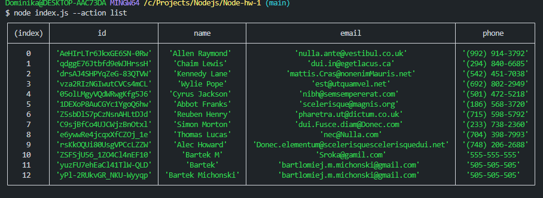
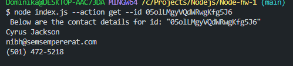
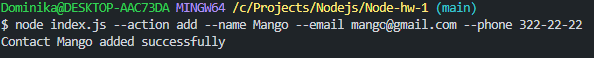
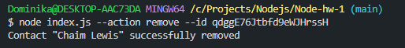

The provided script is a simple command-line application written in JavaScript using Node.js and the commander module. Here's a brief overview of each available command:

List Contacts:

Get Contact by ID:

Add New Contact:

Remove Contact by ID:

For each command, you can use the corresponding options:

-a or --action: Specifies the action (list, get, add, remove).
-i or --id: Contact ID (for get and remove).
-n or --name: Name of the new contact (for add).
-e or --email: Email address of the new contact (for add).
-p or --phone: Phone number of the new contact (for add).
The command examples have been provided above. You can customize the values as needed.
